# IMPORTANT SAFETY NOTICE

This software modifies machine control instructions (G-code) that directly affect the behavior of 3D printers and CNC equipment. Improper use may result in equipment damage, print failure, fire hazard, or personal injury.

By using this tool, you agree that:

* You assume all risks associated with the use of generated or modified G-code.

* You will independently verify all output before use.

* The software is provided “AS IS”, without warranties of any kind.

* In no event shall the authors or contributors be liable for any claim, damages, or other liability arising from use of the software.

The modified gcode from this tool has been tested on an Ender V3 SE and a Bambu Labs A1 Mini.

# G-Code Modifier

A browser-based G-code editor for 3D printing. Load a `.gcode` file, visually inspect layers in 3D, add modifications (pauses, filament changes, Z-offsets, custom commands), measure distances, detect holes for insert placement, and export the modified file — all without installing anything.


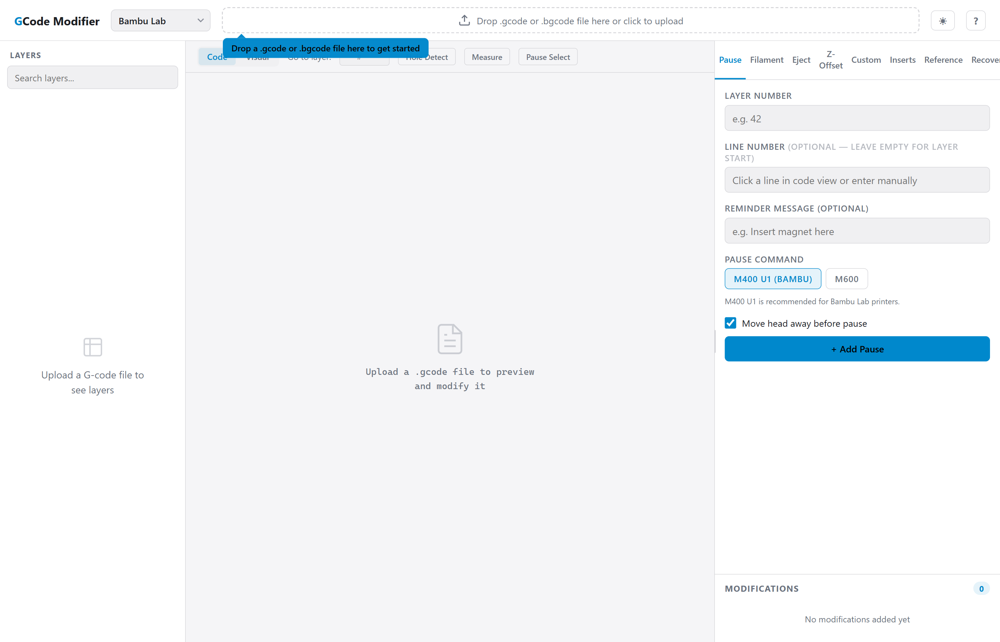

## Getting Started

Open `gcode-modifier.html` in any modern browser (WebGL2 required). No server, build step, or dependencies required.

1. **Select your firmware** from the dropdown (Bambu Lab, Klipper, Marlin, or RepRapFirmware). This determines which pause and filament-change commands are available.
2. **Load a file** by dragging a `.gcode` / `.gco` / `.g` file onto the drop zone, or click to browse.
3. **Browse layers** in the left panel, add modifications in the right panel.
4. **Export** the modified file with the "Export G-Code" button. The output is saved as `<original-name>_modified.gcode`.

A sample file (`test_cube.gcode`) is included in the repository so you can try the tool immediately — see [Test File](#test-file) below.

## Exporting G-Code From Your Slicer

To use this tool you need a `.gcode` file exported from your slicer. Here's how to get one:

### Bambu Studio

1. Open your model and configure print/filament/printer settings as usual.
2. Click **Slice plate** (or press Ctrl+R) to slice the model.
3. Click **Export G-code file** (the folder icon next to the "Print plate" button) in the bottom-right corner.
4. Choose a location and save. The file will be saved as `.gcode`.

> **Tip:** If you normally send prints directly to your printer, the export button is easy to miss — look for the small folder/export icon next to the main print button.

### PrusaSlicer / OrcaSlicer

1. Open your model and configure settings as usual.
2. Click **Slice now** (bottom-right) to slice the model.
3. Click **Export G-code** (the button replaces "Slice now" after slicing) or use **File → Export → Export G-code** (Ctrl+G).
4. Choose a location and save.

> **Note:** OrcaSlicer follows the same workflow as PrusaSlicer. If you have multiple plates, make sure the correct plate is selected before exporting.

### Cura

1. Open your model and configure settings as usual.
2. Click **Slice** in the bottom-right corner.
3. After slicing completes, click **Save to Disk** (the button replaces "Slice" after slicing). If you see "Save to Removable Drive" instead, click the small arrow next to it and select **Save to Disk**.
4. Choose a location and save. The file will be saved as `.gcode`.

> **Tip:** You can also use **File → Export** to save the G-code file.

## Interface Layout

The app uses a three-panel layout: layer navigator on the left, code/visual preview in the center, and modification tools on the right. The right panel can be resized by dragging its left edge — useful for expanding the Reference tab for easier reading. On mobile (< 800px), the layout switches to a vertical stack with a collapsible layer drawer.

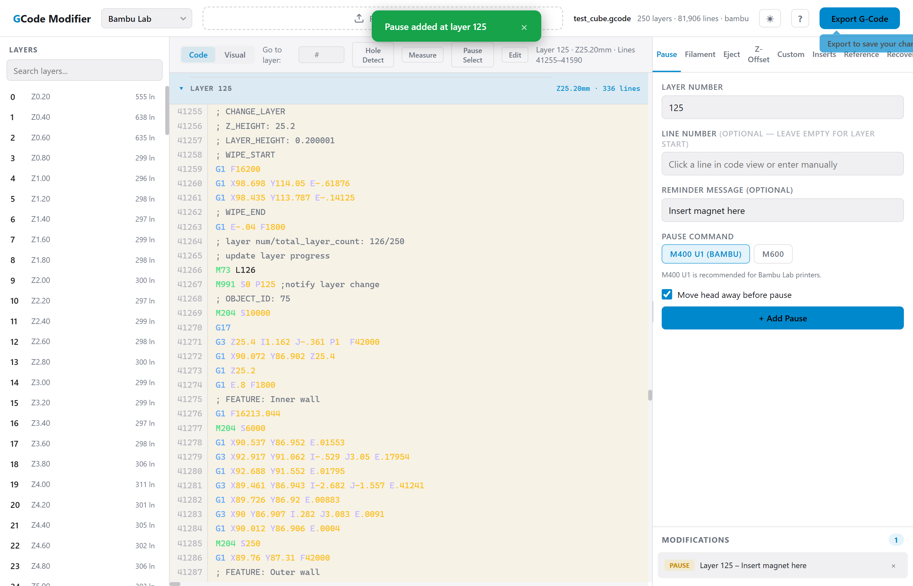

### Left Panel — Layer Navigator

- Lists every layer detected in the file with layer number, Z-height, and line count.
- Orange dot badges indicate layers that have pending modifications.
- Search/filter box at the top to quickly find a layer.
- Click a layer to select it; the center preview and tool inputs update automatically.
- Collapses into a slide-out drawer on narrow viewports (hamburger button in header).

### Center Panel — Preview

Toggle between two views using the **Code** / **Visual** buttons:

**Code View**
- Syntax-highlighted G-code with line numbers.
- Shows the selected layer's lines plus a few lines of surrounding context.
- Modified lines are highlighted in orange at the bottom of the preview.
- Syntax coloring: G-commands (blue), M-commands (green), parameters (purple), values (yellow), comments (gray).

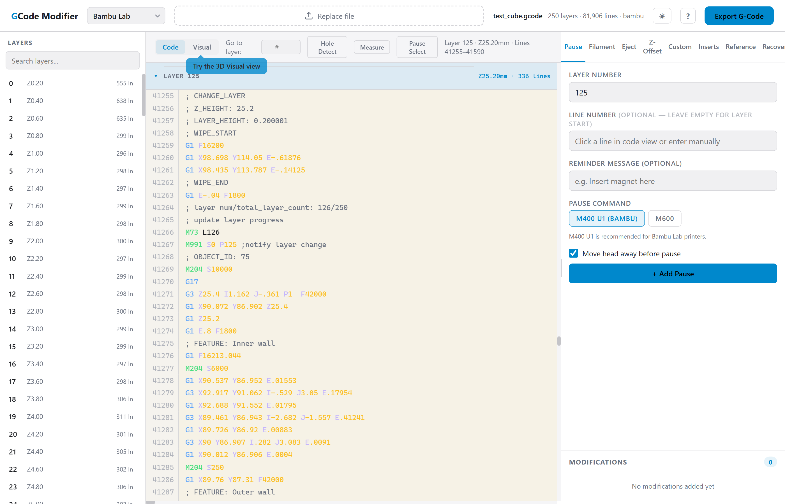

**Visual View (3D)**
- WebGL 3D rendering of the print with stacked layers building up from the bed.
- Color-coded by extrusion type (outer wall, inner wall, infill, support, overhang, etc.).
- Travel moves shown as gray lines on the current layer.
- Lower layers rendered at reduced opacity; current layer is fully opaque.
- 10mm bed grid for spatial reference.
- Modification markers: colored translucent planes at modification Z-heights (yellow=pause, purple=filament, orange=z-offset, cyan=custom).
- Interactive 3D camera controls:
  - **Left-drag**: orbit (rotate around model).
  - **Right/middle-drag**: pan.
  - **Scroll wheel**: zoom in/out.
  - **Touch**: one-finger orbit, two-finger pan, pinch zoom.
  - **F key**: reset camera to default view.
- Layer slider at the bottom for quick layer scrubbing (cumulative — layers build up).
- Modification banners appear at the top when the current layer has queued modifications.

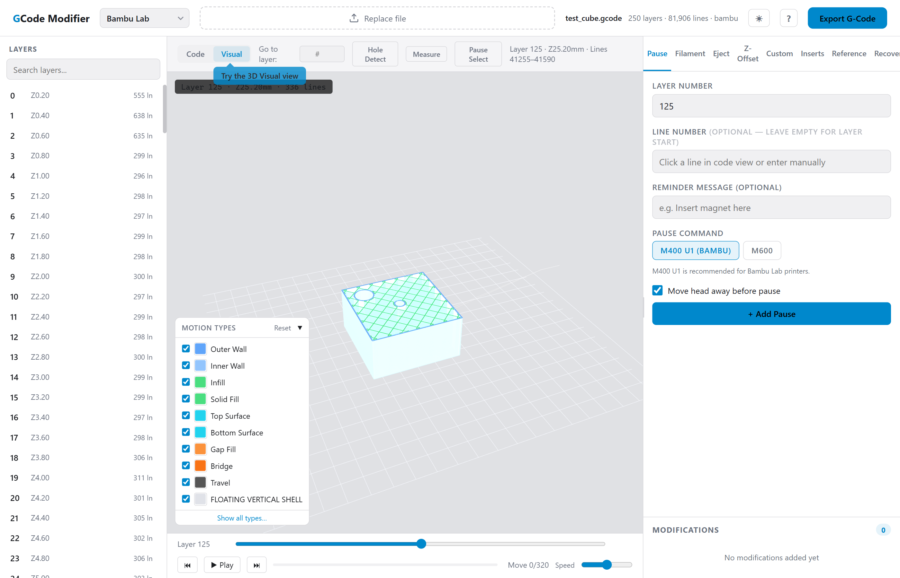

## Slicer Compatibility

The parser auto-detects the slicer from file header comments and adapts its parsing accordingly. The detected slicer is shown in the file info bar.

| Slicer | Layer Format | Type Markers | Status            |
|---|---|---|-------------------|
| **Cura** | `;LAYER:N` | `;TYPE:Outer Wall` | Fully supported   |
| **Bambu Studio** | `; CHANGE_LAYER` + `; Z_HEIGHT` | `; FEATURE: Outer Wall` | Fully supported   |
| **PrusaSlicer** | `;LAYER_CHANGE` + `;Z:X.XX` or `;LAYER:N` | `;TYPE:External perimeter` | Fully supported * |
| **SuperSlicer** | Same as PrusaSlicer | Same as PrusaSlicer | Fully supported   |
| **OrcaSlicer** | Both Bambu and PrusaSlicer formats | Both formats | Fully supported   |
| **Simplify3D** | `; layer N, Z = X.XX` | `; outer perimeter`, `; infill` | Fully supported   |
| **ideaMaker** | `;LAYER:N` | Standard markers | Supported         |
| **Unknown** | Falls back to `;LAYER:N` heuristic | Generic | Best-effort       |

\* Prusa slicer by default exports binary gcode files, to export plain gcode uncheck the following box in your preferences:


[Prusa Binary gcode](test_cube_binary.bgcode)

## Firmware Profiles

Each firmware profile provides the correct pause commands, filament change commands, and relevant hints.

| Firmware | Pause Commands | Filament Change | Notes |
|---|---|---|---|
| **Bambu Lab** | `M400 U1` (recommended), `M600` | `M1020` (AMS slot change), `M600` | AMS slot selector enabled |
| **Klipper** | `PAUSE` macro, `M600`, `M0` | `M600` | Requires macros in `printer.cfg` |
| **Marlin** | `M0`, `M600`, `M25` (SD pause) | `M600` | Requires `ADVANCED_PAUSE_FEATURE` |
| **RepRapFirmware** | `M226`, `M600`, `M0` | `M600` | Uses `pause.g` / `filament-change.g` macros |

## Modification Tools

### Pause

Insert a pause at a specific layer. Useful for embedding magnets, nuts, or swapping colors manually.

- **Layer Number**: which layer to pause before.
- **Reminder Message** (optional): appears as a G-code comment (e.g., "Insert magnet here").
- **Pause Command**: firmware-specific (auto-populated from the selected firmware profile).
- **Move head away**: when enabled, the nozzle lifts 5mm in Z and moves to the front-left corner before pausing, preventing heat damage to the print.

Generated G-code snippet example:
```gcode
; === PAUSE: Insert magnet here ===
G91 ; Relative positioning
G1 Z5 F600 ; Lift Z
G90 ; Absolute positioning
G1 X5 Y5 F6000 ; Move head to front-left
M400 U1 ; Bambu pause
; === END PAUSE ===
```

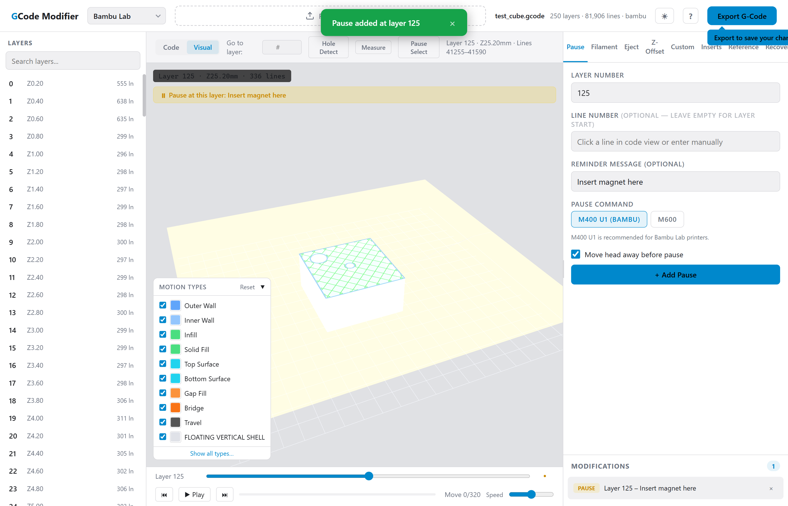

### Filament Change

Trigger a filament swap at a specific layer.

- **Layer Number**: target layer.
- **Filament Slot (AMS)**: only shown for Bambu Lab — selects which AMS slot (1–4) to switch to.
- **Command**: `M1020` for Bambu AMS changes, `M600` for standard filament change on other firmwares.

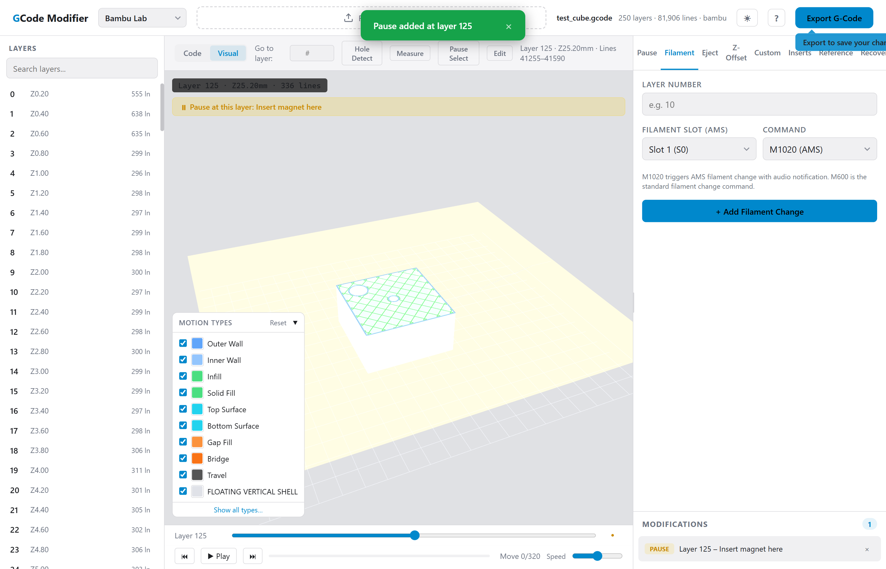

### Eject

Append an auto-eject sequence to the end of the G-code. Only one eject modification is allowed at a time (adding a new one replaces the previous).

- **Bed Y Position**: how far forward to push the bed (mm).
- **Head Z Clearance**: how high to raise the nozzle (mm).
- **Feed Rate**: movement speed in mm/min.
- **Turn off heaters**: disables hotend and bed heaters after eject.
- **Home Z axis**: homes the Z axis after ejecting.
- **Loop mode**: adds a comment noting that the print should restart (actual looping requires external automation or firmware support).

### Z-Offset

Apply a vertical offset to all Z moves within a layer range. Useful for compensating for embedded inserts that change the effective layer height.

- **Start Layer**: first layer to offset.
- **End Layer** (optional): last layer to offset. If blank, the offset applies from the start layer through the end of the print.
- **Z-Offset (mm)**: positive values raise the nozzle, negative values lower it. All `G0`/`G1`/`G2`/`G3` commands containing a Z parameter within the range are adjusted.
- **Note** (optional): descriptive label that appears in the G-code comment.


### Custom G-Code

Insert arbitrary G-code at a specific layer or at the end of the file.

- **Layer Number**: enter a layer number, or `end` to append at the file's end.
- **Custom G-Code**: multi-line textarea — each line is inserted as-is, wrapped in `; === CUSTOM G-CODE ===` / `; === END CUSTOM ===` comment markers.

### G-Code Reference

A built-in reference for ~40 common 3D printing G-code commands, organized by category and adapted to your selected firmware. Each command card includes a beginner-friendly description, a parameter table with units and typical values, real-world multi-line examples, and firmware-specific notes.

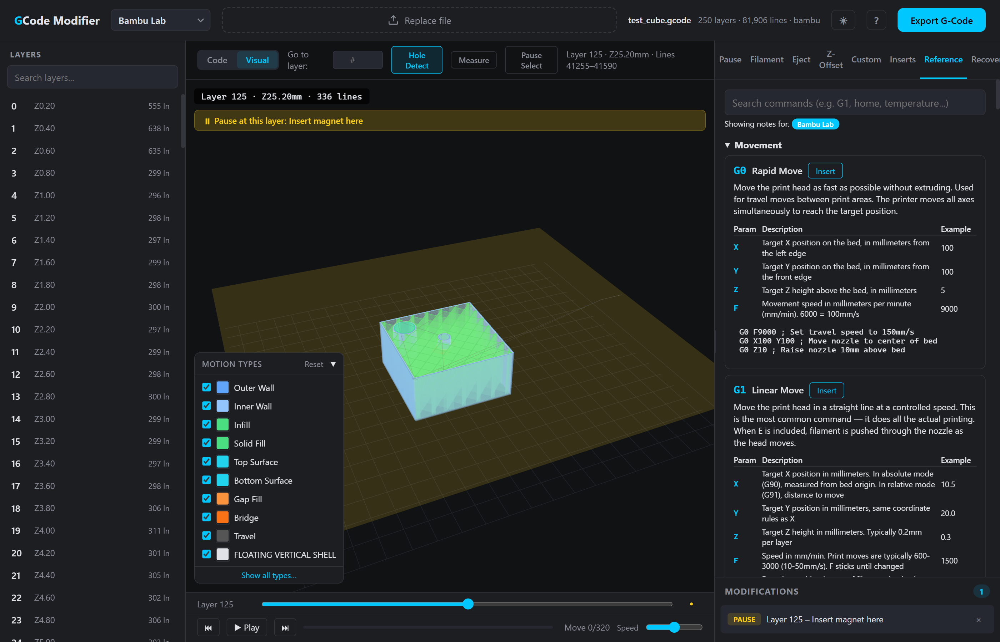

- **Search**: Type in the search box to filter commands by code, name, or description.
- **Categories**: Movement, Temperature, Extrusion, Print Control, Calibration & Leveling, Stepper & Motion, Filament & Material, Display & Communication, PID & Advanced.
- **Firmware notes**: Each command shows firmware-specific tips and warnings based on the firmware selected in the header dropdown.
- **Click to insert**: Click the "Insert" button on any command to populate the Custom G-code tab with that command's template, ready to customize and add as a modification.
- **Keyboard shortcut**: Press `7` to switch to the Reference tab.

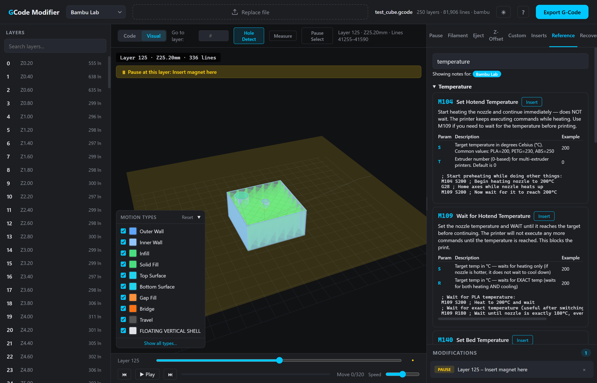

### Inserts (Hole Detection)

Automatically detect holes in the print and calculate the correct pause layer for placing physical inserts (magnets, threaded inserts, etc.).

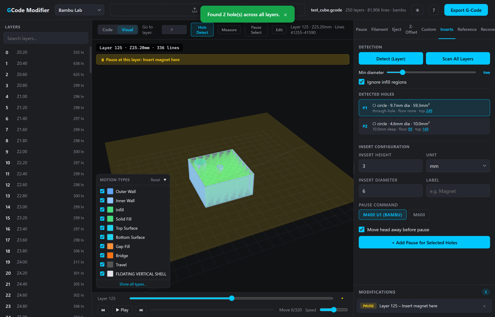

**Two detection modes:**

- **Detect (Layer)**: Detect holes on the currently selected layer only. Useful when you already know which layer to inspect.
- **Scan All Layers**: Automatically scan every layer from top to bottom, find all unique holes in the entire print, and analyze their depth. No need to manually scrub layers to find holes — the tool finds them for you. A progress indicator shows scan status.

**Workflow:**

1. Switch to the Visual view and open the **Inserts** tab.
2. Click **Scan All Layers** (recommended) or navigate to a specific layer and click **Detect (Layer)**.
3. Detected holes appear in the list with diameter, area, depth, floor layer, and (for scanned holes) which layer they were found on.
4. Click a hole in the list to select it — a **green circle highlight** appears on the 3D view at the current layer's Z height showing the hole's position and size.
5. Configure the insert: height (mm or layers), diameter, label, pause command.
6. The tool automatically calculates which layer to pause at based on the hole's floor layer + insert height.
7. Click **Add Pause for Selected Holes** to queue the modifications.

**Detection settings:**
- **Min diameter**: filter out holes smaller than this (range: 1–20mm).
- **Ignore infill regions**: exclude infill patterns from the analysis so only wall-enclosed holes are detected.

**How it works:**

The detector rasterizes each layer's toolpaths onto a grid, uses flood-fill from the borders to identify exterior space, then finds connected components of interior empty cells. Hole diameters are compensated for wall-stamp encroachment to match the actual physical hole size. Depth analysis scans downward from where a hole first appears, looking for the layer where the footprint becomes filled (the floor). Through-holes that go all the way through the print are identified as such.

### Measurement Tool

Measure point-to-point distance on the current layer.

1. Click the **Measure** button in the toolbar.
2. Click two points on the 3D view — crosshair markers appear and a line is drawn between them.
3. The distance in mm is shown as a toast notification.
4. Click again to start a new measurement.

## Undo / Redo

All modification changes (add, remove, reorder) are tracked in an undo stack (up to 50 entries).

- **Ctrl+Z** / **Cmd+Z**: undo the last change.
- **Ctrl+Shift+Z** / **Ctrl+Y**: redo.

## Modifications List

All queued modifications appear in the bottom section of the right panel.

- **Drag to reorder**: drag modification items to change insertion priority for modifications on the same layer.
- **Delete**: remove a modification with the X button.
- **Counter badge**: shows the total number of active modifications.
- Modifications are applied bottom-up (highest layer number first) during export to avoid line-offset issues.

## Toast Notifications

Status messages (success, warning, error) appear as prominent centered notifications at the top of the screen. They auto-dismiss after 4 seconds or can be closed manually.

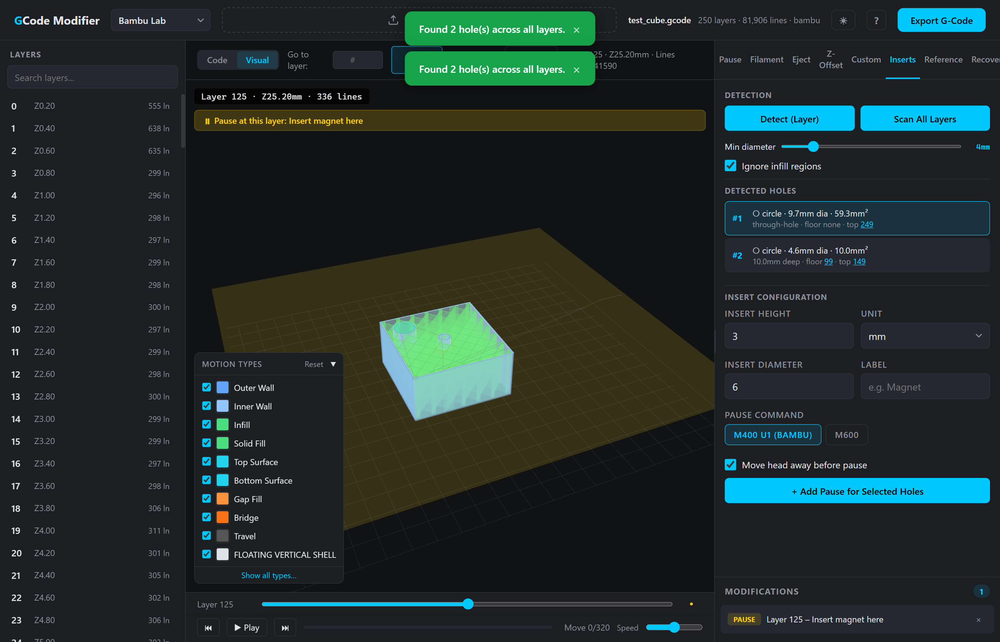

## Theme

Toggle between dark and light themes using the sun/moon button in the header. The theme is saved to localStorage and defaults to your system preference.

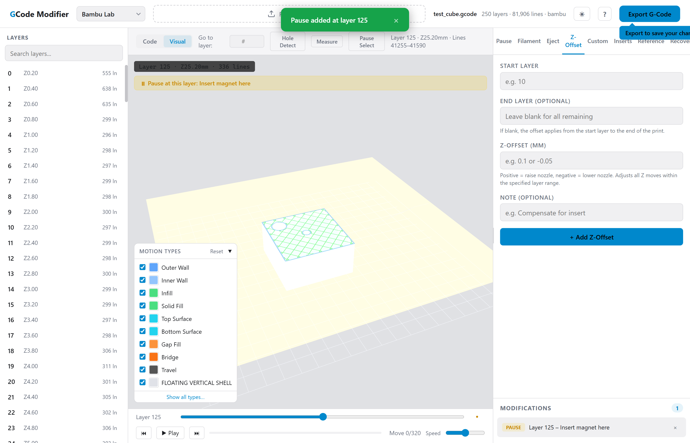

## Keyboard Shortcuts

| Shortcut | Action |
|---|---|
| `Ctrl+O` | Open file |
| `Ctrl+E` | Export |
| `Ctrl+Z` | Undo |
| `Ctrl+Shift+Z` / `Ctrl+Y` | Redo |
| `Space` | Toggle Code/Visual view |
| `[` / `]` | Previous/Next layer |
| Arrow keys | Previous/Next layer |
| `1`–`7` | Switch tool tab |
| `F` | Reset camera |
| `?` | Show keyboard shortcuts help |

Press `?` at any time to see the shortcuts overlay.

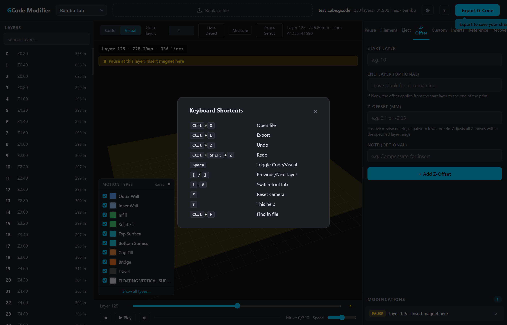

## Test File

A sample G-code file (`test_cube.gcode`) is included in the repository for testing. It's a 50mm test cube sliced with Bambu Studio containing:

- **250 layers** at 0.2mm layer height
- **A through-hole** (~10mm diameter) that goes all the way through the cube
- **A blind pocket** (~5mm diameter, ~10mm deep) designed for placing a threaded insert or magnet

This file is ideal for trying out the hole detection features: load it, click **Scan All Layers**, and both holes will be detected automatically — the through-hole and the interior pocket with its correct floor layer and depth.

## Large File Support

Files over 50,000 lines are parsed asynchronously in chunks with a progress bar, keeping the browser responsive during parsing.

## G-Code Parser

The parser supports multiple layer marker formats:

- **Standard** (Cura, PrusaSlicer, etc.): `;LAYER:N`
- **Bambu Studio**: `; CHANGE_LAYER` + `; Z_HEIGHT: X.X` + `; layer num/total_layer_count: N/M`
- **PrusaSlicer**: `;LAYER_CHANGE` + `;Z:X.XX`
- **Simplify3D**: `; layer N, Z = X.XX`

It also recognizes extrusion type markers from all supported slicers and normalizes them to standard categories (WALL-OUTER, WALL-INNER, FILL, SUPPORT, etc.).

Supported move commands: `G0`/`G1` (linear), `G2`/`G3` (arc — approximated as line segments for visual rendering). Extrusion mode tracking handles both absolute (`M82`) and relative (`M83`) E-axis modes.

Malformed lines are gracefully skipped with a warning count shown after parsing.

## Browser Compatibility

Requires a modern browser with WebGL2 support (Chrome 56+, Firefox 51+, Edge 79+, Safari 15+). No external dependencies — the entire application is a single self-contained HTML file. All processing happens client-side; no data is uploaded anywhere.

## For Developers

The source code lives in `src/` as ES modules. A zero-dependency Node build script inlines everything back into the single `gcode-modifier.html` at the repo root.

### Project Structure

```
src/
  index.html          # HTML + CSS template 
  parser.js            # GcodeParser class
  modifier.js          # GcodeModifier class
  hole-detector.js     # HoleDetector class
  insert-manager.js    # InsertManager class
  undo-stack.js        # UndoStack class
  viewer3d.js          # GcodeViewer3D (WebGL) class
  bgcode.js            # Binary G-code decoder (Heatshrink, MeatPack, CRC32)
  firmware.js          # Firmware profiles + G-code reference data
  ui.js                # All UI functions (tabs, toasts, layers, mods, etc.)
  app.js               # App init, state, event wiring
build.js               # Build script: inline src/*.js into single HTML
test/                  # Unit tests (node --test)
```

### Build

```bash
node build.js
```

Reads `src/index.html`, strips `import`/`export` syntax from each `src/*.js` file, concatenates them in dependency order, and writes `gcode-modifier.html`. The built file must be committed — it's what end users open.

### Tests

```bash
npm test
# or
node --test test/*.test.js
```

Tests cover the pure-logic modules (parser, modifier, bgcode, undo-stack) and run in Node.js without a browser.

### Contributing

1. Edit files in `src/`, not `gcode-modifier.html` directly.
2. Run `node build.js` to regenerate the built file.
3. Run `npm test` to verify nothing broke.
4. Commit both the source changes and the rebuilt `gcode-modifier.html`.

**If your change touches G-code modifications** (parser, modifier, or export logic), you must manually verify the output before submitting a PR:

1. Load a test file (e.g., `test_cube.gcode`) in the browser.
2. Add the relevant modification (pause, filament change, z-offset, recovery, etc.).
3. Export the modified file and inspect the output G-code — confirm the commands are inserted at the correct layer and the surrounding G-code is intact.
4. Re-import the exported file to verify it parses and renders correctly in the 3D viewer.

Automated tests cover the modifier and parser logic, but G-code modifications directly control physical machines — a bad export can damage equipment or cause a fire. Always verify the actual output.

CI will fail the PR if the committed built file doesn't match `node build.js` output.
