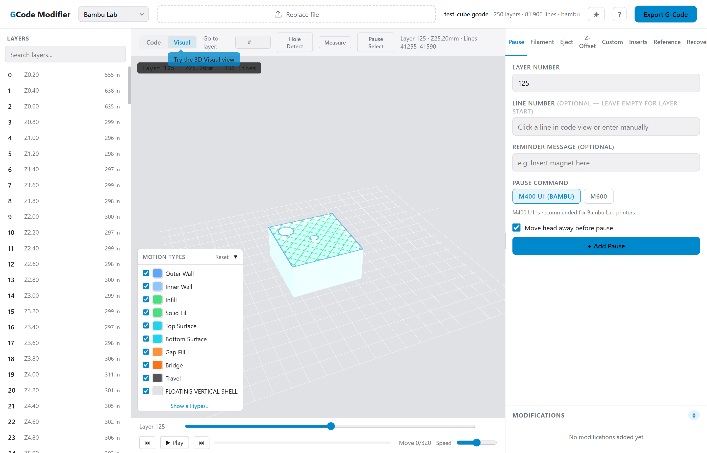
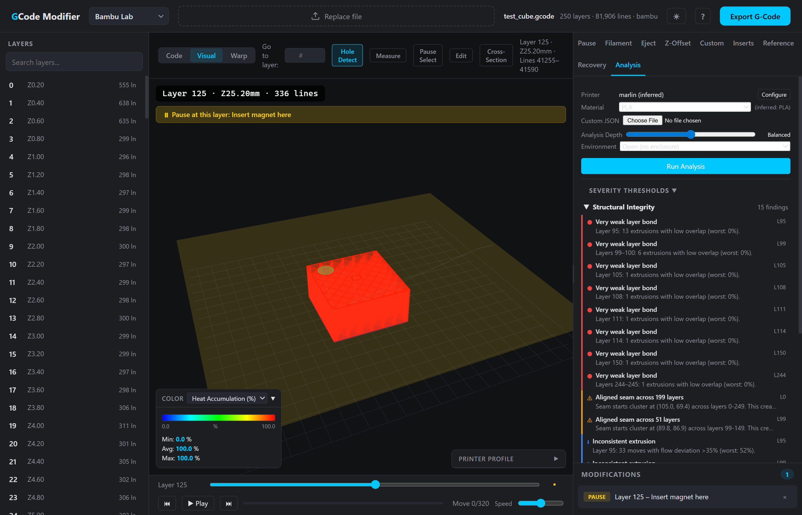
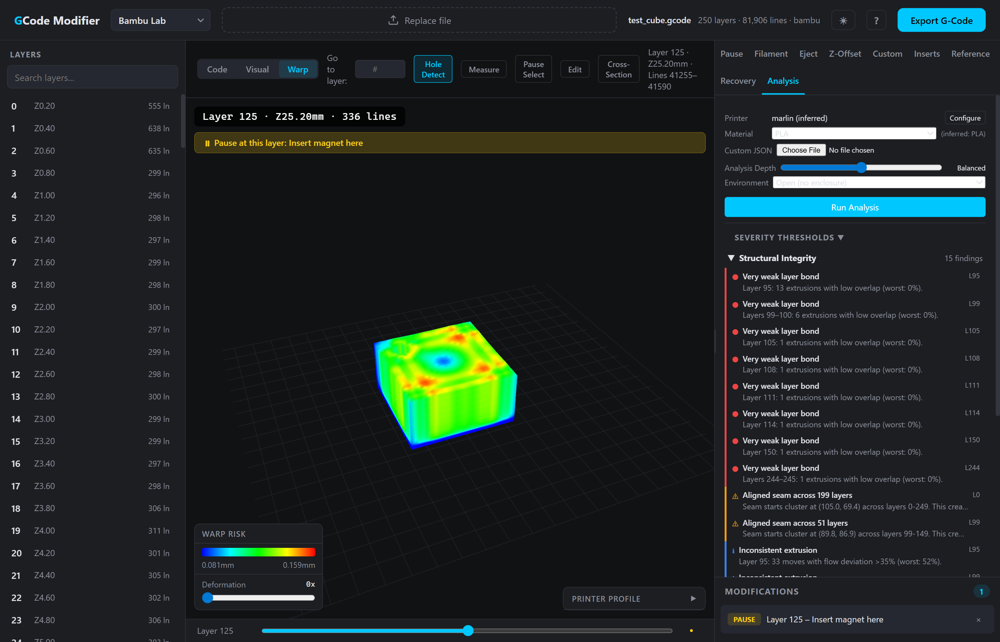
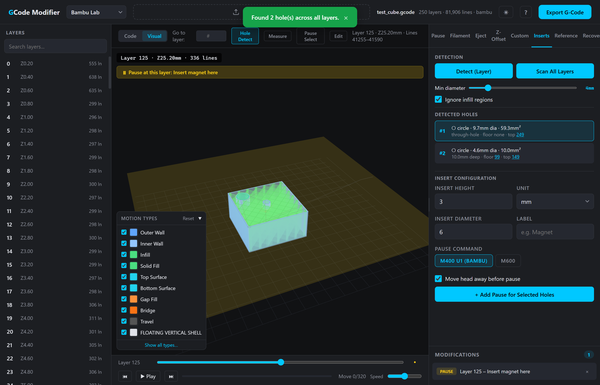
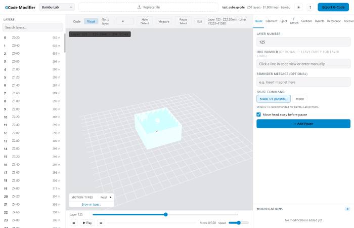
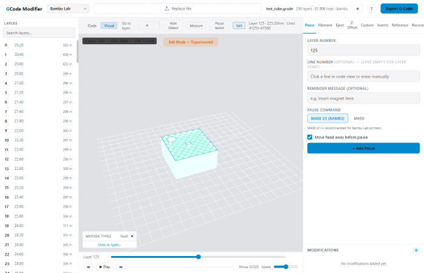
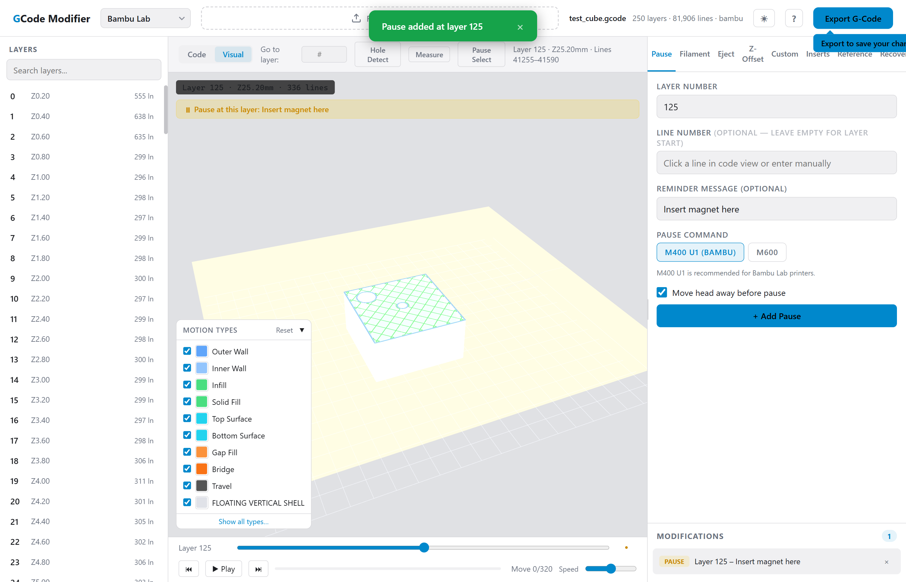
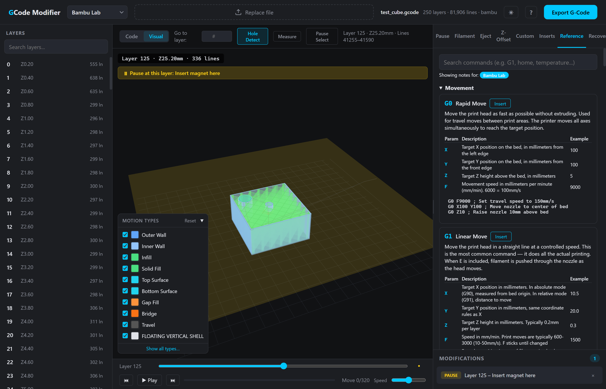

# G-Code Modifier

A browser-based G-code editor and print analyzer for 3D printing. Inspect layers in 3D, simulate prints, detect potential failures before they happen, and modify G-code — all without installing anything.

**[Try it live](https://little-did-i-know.github.io/Gcode/gcode-modifier.html)** — no download required.



## Features

| | |
|---|---|
|  **3D Visualization** — WebGL layer viewer with motion-type coloring, travel moves, and interactive camera |  **Print Analysis** — Thermal simulation, structural analysis, and motion kinematics with 12 heatmap overlay modes |
|  **Warp Prediction** — 3D warp mesh with material-aware failure prediction and adjustable deformation preview |  **Hole Detection** — Scan all layers to find holes, calculate insert depths, and auto-add pauses |
|  **Print Simulation** — Move-by-move playback with speed control and automatic pause detection |  **Edit Mode** — Select, edit, or delete individual G-code moves directly in 3D with live preview |
|  **Layer Modifications** — Pauses, filament changes, Z-offsets, eject sequences, recovery, and custom G-code |  **G-code Reference** — 40+ commands with firmware-specific notes and click-to-insert |

## Getting Started

1. Open the **[live version](https://little-did-i-know.github.io/Gcode/gcode-modifier.html)** or open `gcode-modifier.html` locally (WebGL2 required)
2. Select your firmware from the dropdown (Bambu Lab, Klipper, Marlin, RepRapFirmware)
3. Drop a `.gcode` / `.gco` / `.g` file onto the page
4. Browse layers, run analysis, add modifications, and export

## Slicer Compatibility

| Slicer | Status |
|---|---|
| Cura, Bambu Studio, PrusaSlicer, OrcaSlicer, SuperSlicer, Simplify3D, ideaMaker | Fully supported |

> PrusaSlicer exports binary G-code by default. Uncheck the binary option in preferences to export plain `.gcode`.

## For Developers

Source lives in `src/` as ES modules. A zero-dependency build script inlines everything into a single `gcode-modifier.html`.

```bash
node build.js            # build
node --test              # run tests
```

Edit files in `src/`, not `gcode-modifier.html` directly. Run both commands before committing.

## Documentation

- **[User Guide](../../wiki)** — detailed feature documentation, keyboard shortcuts, firmware profiles
- **[Analysis Theory](../../wiki)** — thermal model, structural analysis, motion kinematics
- **[DISCLAIMER.md](DISCLAIMER.md)** — safety notice and liability

## License

[MIT](LICENSE) — see [DISCLAIMER.md](DISCLAIMER.md) for safety and liability terms.
